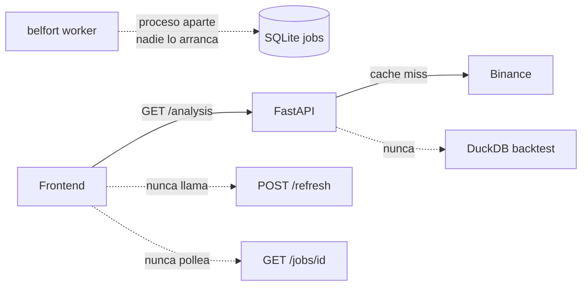
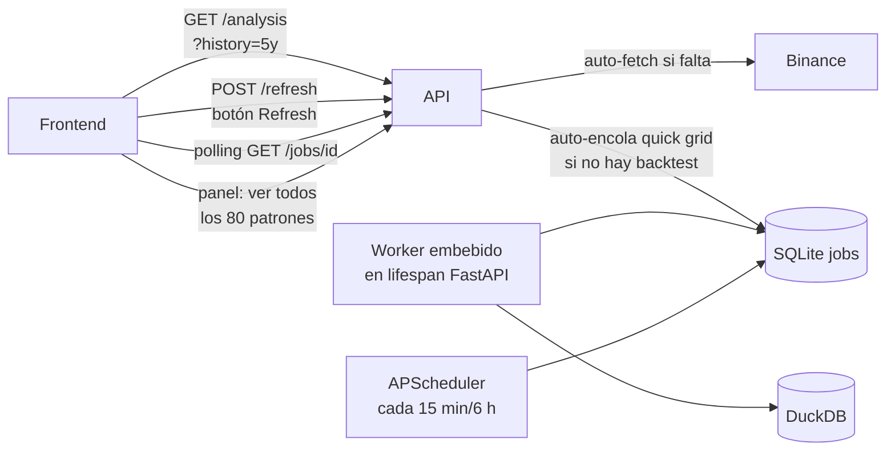

## Diagnóstico (qué falla hoy)



- `GET /analysis` ya itera los ~80 patrones pero solo devuelve los activos en la **última vela** (suelen ser 3-8) — el usuario percibe "faltan patrones".
- `GET /backtest` devuelve ceros con `note` que el frontend ni renderiza.
- Worker existe pero es proceso separado.
- `since='2y'` hardcoded en `[backend/src/belfort/analysis.py](backend/src/belfort/analysis.py)` línea 156.
- Puerto frontend (`:8000` en `[frontend/src/lib/env.ts](frontend/src/lib/env.ts)`) ≠ backend (`:8001` default en `[backend/src/belfort/cli/serve.py](backend/src/belfort/cli/serve.py)`).

## Objetivo



## Decisiones fijadas (tras Q&A)

- **Profundidad histórica**: selector en UI (`2y / 5y / max`) persistido por símbolo en Zustand; backend acepta `?history=` y lo pasa a `binance.fetch`.
- **Backtest**: grid reducido automático en cold start (~2 min) + botón "grid completo" + scheduler periódico configurable (default cada 6 h).
- **Worker**: embebido en `belfort serve` vía FastAPI `lifespan` (un proceso, cero configuración).

## Cambios concretos

### A. Backend — automatización y profundidad histórica

1. **Puerto**: cambiar default `belfort serve` a `8000` en `[backend/src/belfort/cli/serve.py](backend/src/belfort/cli/serve.py)` y `[backend/src/belfort/config.py](backend/src/belfort/config.py)` para alinear con frontend.
2. **Worker embebido** + **scheduler** en `[backend/src/belfort/api/main.py](backend/src/belfort/api/main.py)` con `@asynccontextmanager` lifespan:
   ```python
   @asynccontextmanager
   async def lifespan(app):
       worker_task = asyncio.create_task(run_worker_async())
       scheduler = AsyncIOScheduler()
       scheduler.add_job(refresh_all_symbols, "interval", minutes=15)
       scheduler.add_job(rerun_quick_backtest, "interval", hours=6)
       scheduler.start()
       yield
       scheduler.shutdown(); worker_task.cancel()
   ```
   Añadir `apscheduler>=3.10` a `[backend/pyproject.toml](backend/pyproject.toml)`.
3. **Worker async-friendly**: refactor `[backend/src/belfort/jobs/worker.py](backend/src/belfort/jobs/worker.py)` para exponer `run_worker_async()` (usa `asyncio.sleep` + `asyncio.to_thread` para los handlers CPU-bound).
4. **Fix job `analyze`**: hoy solo cuenta filas; cambiar a `load(refresh=True)` + invalidar cache de análisis cuando exista.
5. **Profundidad histórica configurable**:
   - `[backend/src/belfort/analysis.py](backend/src/belfort/analysis.py)`: añadir param `history` (default `"5y"`).
   - `[backend/src/belfort/api/routes/analysis.py](backend/src/belfort/api/routes/analysis.py)` y `ohlcv.py`: añadir `?history=2y|5y|max`.
   - `[backend/src/belfort/data/binance.py](backend/src/belfort/data/binance.py)::_parse_since`: soportar `"max"` (sin `since_ms`).
6. **Quick grid** en `[backend/src/belfort/backtest/grid.py](backend/src/belfort/backtest/grid.py)`:
   ```python
   _QUICK_SL_ATR = [1.5]
   _QUICK_TP_RR = [2.0, 3.0]
   _QUICK_FILTER_TREND = ["none", "sma200"]
   def quick_combos() -> list[dict]: ...   # ~12 combos vs 243 del full
   def run_all_quick(symbol, tf, df): ...
   ```
7. **Auto-trigger en `/analysis`**: si `has_any_results(symbol, tf) == False`, encolar job `backtest_quick` y añadir `backtest_status: "pending"` a la respuesta.
8. **Nuevo endpoint `GET /analysis/{symbol}/patterns/all`** que devuelve los ~80 patrones con `{id, name, category, status: "active"|"recent"|"inactive", last_occurrence_bar, occurrences_last_100_bars}` — resuelve la queja "no se analizan todos los patrones".
9. **Nuevo endpoint `POST /symbols/{symbol}/init?history=5y`** que orquesta cold-start: encola `data_fetch` y `backtest_quick`, devuelve `{data_job_id, backtest_job_id}`.
10. **OpenAPI**: documentar `POST /refresh`, `POST /init`, `GET /jobs/{id}`, `GET /patterns/all` en `[contracts/openapi.yaml](contracts/openapi.yaml)` para regenerar tipos en frontend.
11. **Progreso de jobs**: en `[backend/src/belfort/jobs/queue.py](backend/src/belfort/jobs/queue.py)` añadir columnas `progress_current INTEGER, progress_total INTEGER, progress_message TEXT` + helper `update_progress(job_id, current, total, msg)`. Los handlers de grid lo actualizan cada N patrones.

### B. Frontend — UI automática

1. **Regenerar tipos**: `pnpm gen:types` tras actualizar OpenAPI → `[frontend/src/api/types.ts](frontend/src/api/types.ts)`.
2. **Selector de historial** en `[frontend/src/components/layout/app-header.tsx](frontend/src/components/layout/app-header.tsx)` + estado en `[frontend/src/lib/store.ts](frontend/src/lib/store.ts)`:
   ```ts
   history: "2y" | "5y" | "max"   // default "5y", persistido en localStorage
   ```
   Pasarlo a todos los hooks (`useAnalysis`, `useOhlcv`, `useBacktest`).
3. **Auto-init**: en `[frontend/src/app/page.tsx](frontend/src/app/page.tsx)` un `useEffect` que detecta cold start (analysis 404) → llama `POST /symbols/{symbol}/init` → guarda job IDs en store → muestra `<JobProgressBanner />`.
4. **Hook nuevo** `frontend/src/api/hooks/use-job.ts`:
   ```ts
   export function useJob(jobId?: string) {
     return useQuery({
       queryKey: ["job", jobId],
       queryFn: () => api.GET("/jobs/{id}", {...}),
       enabled: !!jobId,
       refetchInterval: (q) =>
         q.state.data?.status === "running" ? 2000 : false,
     });
   }
   ```
5. **Hook nuevo** `frontend/src/api/hooks/use-patterns-all.ts` para el endpoint completo de patrones.
6. **Componente nuevo** `frontend/src/components/feedback/job-progress.tsx`: progress bar con `current/total` y mensaje, autocierra al `done`.
7. **Página de patrones completa**: nueva sección o página `frontend/src/app/asset/[symbol]/patterns/page.tsx` que renderiza los 80 patrones agrupados por categoría con badges `activo / reciente (<5 velas) / inactivo`.
8. **RefreshButton**: en `[frontend/src/components/selectors/refresh-button.tsx](frontend/src/components/selectors/refresh-button.tsx)` llamar `POST /analysis/{symbol}/refresh` y `POST /backtest/{symbol}/refresh` ANTES de invalidar React Query.
9. **Strategy page**: en `[frontend/src/app/asset/[symbol]/strategy/page.tsx](frontend/src/app/asset/[symbol]/strategy/page.tsx)`:
   - Si `backtest_status === "pending"` mostrar `<JobProgressBanner />`.
   - Botón "Ejecutar grid completo" (POST `/backtest/{symbol}/refresh?mode=full`).
   - Mostrar `note` del backend.
10. **Auto-refresh periódico**: en `[frontend/src/lib/query-client.ts](frontend/src/lib/query-client.ts)` `refetchInterval: 15 * 60_000` para analysis/ohlcv (cuando la pestaña está activa).

### C. Documentación y limpieza

- Actualizar `[frontend/README.md](frontend/README.md)` quitando la instrucción "antes del primer uso, descarga OHLCV con belfort data fetch".
- Actualizar `[backend/README.md](backend/README.md)`: "`belfort serve` ahora arranca worker + scheduler automáticamente".
- Tests nuevos para `/init`, `/patterns/all`, progress de jobs.

## Comportamiento esperado tras los cambios

| Acción usuario | Lo que pasa solo |
|---|---|
| Entra a la app por primera vez con `BTC` | Frontend detecta cold start → POST `/init?history=5y` → barra de progreso "Descargando 11k velas…" → "Ejecutando backtest rápido…" → resultados visibles en ~3 min |
| Cambia profundidad a `max` | Hook re-llama con `?history=max` → backend descarga incremental el delta → nuevo análisis |
| Pulsa Refresh | POST `/refresh` (data + analysis) → polling /jobs → invalidate → UI actualizada |
| Va a "Patrones" | Ve los 80 patrones con estado activo/reciente/inactivo, sin filtrar por última vela |
| Va a "Estrategia" | Ve métricas del quick-grid. Botón "Grid completo" lanza job de 20 min con barra de progreso |
| Deja la app abierta | Cada 15 min auto-refresh OHLCV, cada 6 h re-run quick grid (transparente) |
