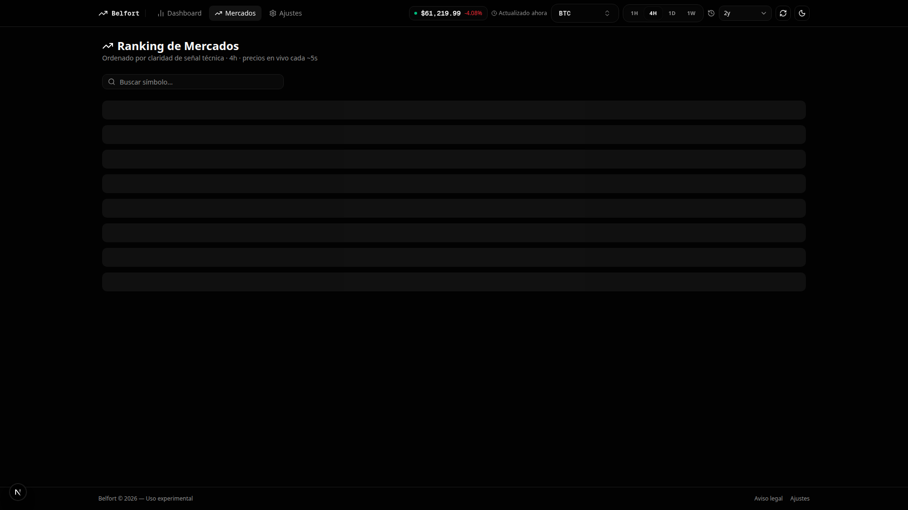
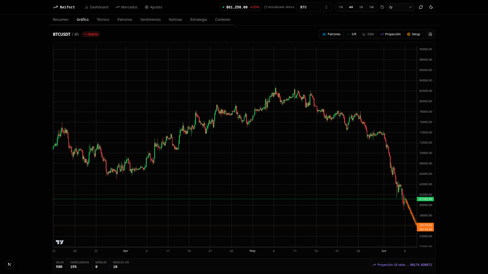
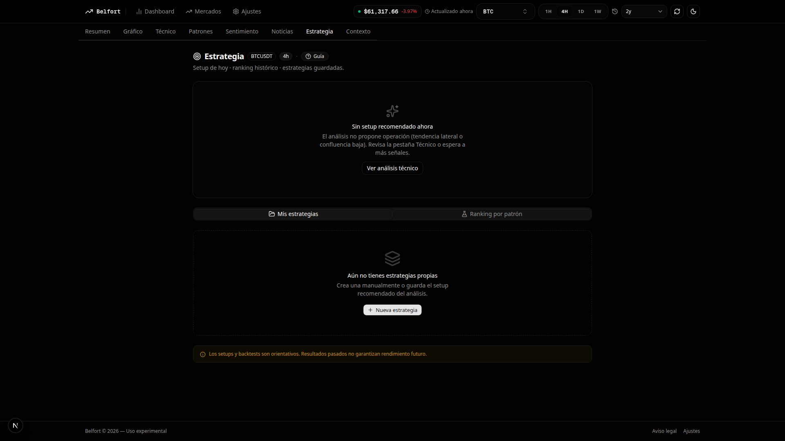
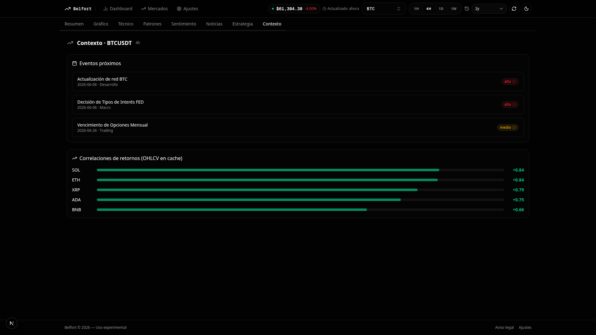
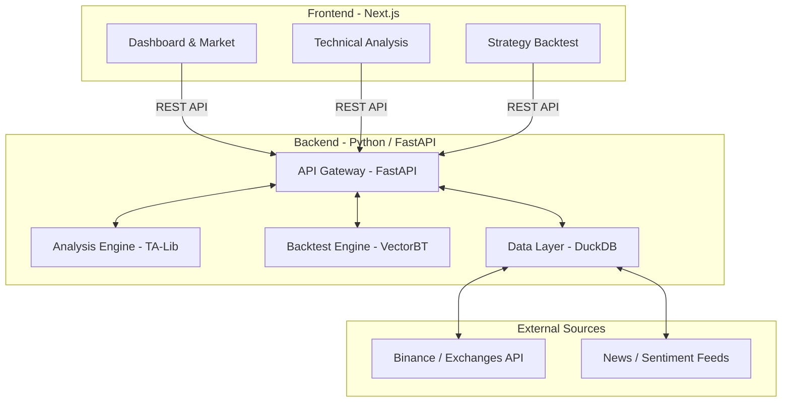

<h1 align="center">📈 Investments Belfort</h1>

<div align="center">
  
  
  
  
  
</div>
<br>

**Investments Belfort** is a full-stack crypto analysis and backtesting platform I've been building. Instead of relying on gut feelings, it uses a Python backend (TA-Lib) to automatically spot candlestick patterns, support/resistance levels, and market confluences. 

To prove if these setups actually work, the platform runs massive, highly concurrent backtests using **VectorBT** and **DuckDB**, churning through millions of simulated trades in seconds. Everything is wrapped up in a sleek, fast **Next.js** web interface that brings the data to life.

---

## ✨ What it actually does

* **Pattern & Level Detection**: The Python backend crunches OHLCV data to find exact technical setups (engulfing patterns, multi-timeframe support/resistance, etc.) without human bias.
* **Brute-Force Backtesting**: Thanks to `VectorBT` and `DuckDB`, you can run a grid search across thousands of parameter combinations instantly to see what actually turns a profit.
* **Market Sentiment**: Pulls live data from Reddit and crypto news feeds to give you a read on what the market is feeling.
* **Modern Stack**: Built with a FastAPI backend for speed and a Next.js (React 19) frontend that looks and feels like a premium trading terminal.

---

## 📸 Screenshots (Web Interface)

Explore the Belfort user interface in action:

### 📊 Main Dashboard (Markets & Rankings)
Get a high-level overview of the market with real-time rankings and a beautifully designed heatmap.


### 📈 Detailed Technical Analysis (Patterns, Structure & Confluences)
Dive deep into the charts with advanced candlestick pattern recognition, support/resistance plotting, and multiple technical indicators.


### 🧪 Strategy Backtesting & Grid Optimization
Run massive, highly concurrent backtests and optimize your trading strategies using our robust grid optimization interface.


### 💬 Sentiment Analysis (News, Reddit & RSS)
Gauge the pulse of the market with our aggregated sentiment analysis, bringing together the latest news, Reddit discussions, and overall sentiment scores.


---

## 🏗️ System Architecture

The Belfort ecosystem is structured into a high-performance Backend focused on data processing, and a modern Frontend for visualization, both communicating through an OpenAPI contract.



---

## 🛠️ Prerequisites

Before you begin, ensure you have the following installed on your system:
* **Python 3.10 or higher** (using `uv` or `venv` is recommended)
* **Node.js 18 or higher** and **pnpm** (for the frontend)
* **TA-Lib** (C library required by the backend engine)

### TA-Lib Installation on Ubuntu/Debian:
```bash
sudo apt-get update
sudo apt-get install build-essential libta-lib-dev || (
  wget http://prdownloads.sourceforge.net/ta-lib/ta-lib-0.4.0-src.tar.gz &&
  tar -xzf ta-lib-0.4.0-src.tar.gz && cd ta-lib &&
  ./configure --prefix=/usr && make && sudo make install
)
```

---

## 🚀 Quick Start

Follow these steps to get the application running locally:

### 1. Configure and Install the Backend

```bash
cd backend

# Copy the example environment file and adjust if necessary
cp .env.example .env

# Install backend dependencies (including TA-Lib and testing dependencies)
uv pip install -e ".[talib,test]"
# Or if using standard pip:
pip install -e ".[talib,test]"

# Verify that the backend installation was successful
belfort doctor
```

### 2. Fetch Data and Start the API Server

Before using the web client, you must download historical data and start the FastAPI server:

```bash
# Download historical candlestick data (OHLCV) from Binance for BTC and ETH (e.g., 2 years with 4h timeframe)
belfort data fetch BTCUSDT --tf 4h --since 2y
belfort data fetch ETHUSDT --tf 4h --since 2y

# (Optional) Run the pattern analysis pipeline and initial backtesting
belfort analyze BTCUSDT --tf 4h
belfort backtest all BTCUSDT --tf 4h --workers 4

# Start the FastAPI server on port 8000
source activate.sh
belfort serve --port 8000
```

### 3. Configure and Start the Frontend (UI)

In a **new terminal**, navigate to the frontend folder and start the application:

```bash
cd frontend

# Set up local environment variables
cp .env.local.example .env.local

# Install dependencies and start the Next.js development server
pnpm install
pnpm dev
```

Once started, open your browser at [http://localhost:3000](http://localhost:3000).

---

## 💻 CLI Usage (Command Line Interface)

The `belfort` command provides multiple useful tools from the terminal for management and automated analysis:

* **Dependency Diagnostics:** `belfort doctor`
* **Fetch Candlestick Data:** `belfort data fetch <Symbol> --tf <Timeframe> --since <Period>`
* **Pattern Analysis:** `belfort analyze BTCUSDT --tf 4h`
* **List Supported Patterns:** `belfort patterns list`
* **Run a Simple Backtest:**
  ```bash
  belfort backtest run BTCUSDT --tf 4h --pattern cdl_engulfing --sl-atr 1.5 --tp-rr 2
  ```
* **Batch Optimization (Grid Backtest of all patterns and parameters):**
  ```bash
  belfort backtest all BTCUSDT --tf 4h --workers 4
  ```
* **Top Results Report:**
  ```bash
  belfort backtest report BTCUSDT --tf 4h --top 20 --sort sharpe
  ```

---

## 📂 Project Structure

The monorepo is organized as follows:

* [`backend/`](backend/) — Core Belfort engine written in Python (FastAPI, CLI, TA-Lib, VectorBT, DuckDB).
* [`frontend/`](frontend/) — Modern user application written in Next.js (React 19, TypeScript, Tailwind, Lightweight Charts).
* [`contracts/`](contracts/) — OpenAPI definitions shared between backend and frontend.
* [`docs/`](docs/) — Documentation and graphical resources.

---

## 🛡️ License

Personal experiment without explicit commercial license. All rights reserved.
